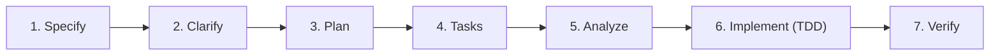

# SDD Workflow: Spec-Driven Development Lifecycle

This skill governs the end-to-end Spec-Driven Development process for all changes in the Artur Yusupov Portfolio workspace.

---

## 1. The 7-Stage SDD Pipeline

Every feature or architectural refactor must progress through the following deterministic phases:

### Stage 1: Specify
- Create `specs/<feature-slug>/spec.md` using the template `.specify/templates/spec.md`.
- Define functional requirements (FR), non-functional requirements (NFR), and acceptance criteria.
- Adhere to the Constitution: zero `any`, zero em dashes, trilingual parity.

### Stage 2: Clarify
- Identify architectural ambiguities, trade-offs, and design choices.
- Resolve open questions with the user before drafting implementation tasks.

### Stage 3: Plan
- Create `specs/<feature-slug>/plan.md` using `.specify/templates/plan.md`.
- Outline component hierarchy, data flow, migration steps, and risk mitigations.

### Stage 4: Tasks
- Create `specs/<feature-slug>/tasks.md` using `.specify/templates/tasks.md`.
- Deconstruct plan into fine-grained atomic tasks.
- For each task, require a designated Red test and empty Red Failure Proof block.

### Stage 5: Analyze
- Create `specs/<feature-slug>/analysis.md` using `.specify/templates/analysis.md`.
- Measure and record baseline metrics: test coverage, bundle sizes, Lighthouse CWV, and axe violations.

### Stage 6: Implement (Strict TDD)
- For every task:
  1. Write failing test first (`Red`).
  2. Execute test and record failure output in `tasks.md` under `Red Failure Proof`.
  3. Write minimum necessary production code (`Green`).
  4. Execute test and record success proof.
  5. Refactor while maintaining green status.

### Stage 7: Verify
- Run complete quality harness:
  - `pnpm exec tsc --noEmit`
  - `pnpm lint`
  - `pnpm test:all`
  - `pnpm audit --prod --audit-level=high`
  - `pnpm build`
- Measure post-implementation metrics and update `analysis.md`.

---

## 2. Hard Stop Gates and Policies

1. **User Alignment Gate**: Between major architectural phases, present results and request confirmation before proceeding.
2. **Red-First Gate**: Code modifications without an existing failing test in `tasks.md` are strictly prohibited.
3. **Constitution Invariance**: The Constitution (`.specify/memory/constitution.md`) cannot be modified without explicit user authorization.
4. **Style Compliance**: Never use em dashes (use hyphens `-` only). Never add emojis to technical project data.
