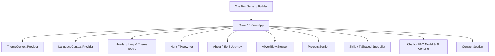

# Portfolio Architecture Specification

A technical overview of the directory structure, build system, deployment mechanisms, and runtime logic of the Artur Yusupov Portfolio Application.

---

## 🏗️ 1. System Architecture

The application is structured as a high-performance **Single Page Application (SPA)** using React 19, TypeScript, and Vite.



---

## 📁 2. Directory Structure

The core files and components are structured as follows:

```text
Portfolio/
├── .github/workflows/
│   └── deploy.yml          # CI/CD Deployment Workflow
├── src/
│   ├── assets/             # Global visual resources and images
│   ├── components/         # Modular React Components
│   │   ├── projects/       # Individual project case study files
│   │   ├── About.tsx       # Bio & journey timeline
│   │   ├── AiWorkflow.tsx  # Dynamic Spec-Driven SDLC stepper
│   │   ├── Header.tsx      # Sticky navigation, theme & language toggle
│   │   ├── Skills.tsx      # T-Shaped Specialist component
│   │   └── ChatModal.tsx   # Floating client-side FAQ bot
│   ├── contexts/           # Theme (Dark/Light) & Language (i18n) providers
│   │   ├── ThemeContext.tsx
│   │   └── LanguageContext.tsx
│   ├── data/
│   │   └── chatFaq.ts      # Multilingual FAQ Chatbot database
│   ├── locales/            # i18n Translation dictionaries & types
│   │   ├── types.ts        # Strict Translation interface
│   │   ├── en.ts           # English translations
│   │   ├── ua.ts           # Ukrainian translations
│   │   └── es.ts           # Spanish translations
│   ├── App.tsx             # Root Layout manager
│   ├── index.css           # Tailwind v4 import & custom styles
│   └── main.tsx            # Application entrypoint mount
├── DESIGN_SYSTEM.md        # Styles, typography, and grids spec
├── SECURITY.md             # CSP, Base64 encryption, and secrets policy
├── ARCHITECTURE.md         # Current file (System overview)
└── package.json            # Dependencies and scripts definitions
```

---

## ⚡ 3. Runtime Logic & Navigation

### Theme Context
- A React Context (`ThemeContext`) controls dark-mode state by toggling the `.dark` class on the root `document.documentElement` element.
- Tailwind CSS v4 custom variant rules map the `.dark` selector to apply dark-themed styles (`dark:bg-*`, `dark:text-*`).

### Internationalization (i18n) Subsystem
- Driven by a custom `LanguageContext` providing strict type-checked translations via `useLanguage()`.
- **Supported Languages:** 3 languages — English (`en`), Ukrainian (`ua`), and Spanish (`es`).
- **Header Language Switcher:** A 3-language interactive dropdown menu (`🇬🇧 EN`, `🇺🇦 UA`, `🇪🇸 ES`) with custom SVG flag icons and click-outside dismissal.
- **Auto-Detection:** Detects visitor's browser language on first load (`navigator.language` matching `uk`/`ua` → `ua`, `es` → `es`).
- **Persistence:** Persists language preference in `localStorage.portfolio_lang`.
- **Localization:** Supports `en.ts`, `ua.ts`, and `es.ts` translation dictionaries. Project case studies include `descriptionUa`/`descriptionEs` and `fullDescriptionUa`/`fullDescriptionEs` for dynamic localized rendering.

### Smooth Scroll Navigation
- Navigation uses standard HTML `#anchor` links mapped to section `id`s.
- Active states are tracked via scroll event listeners on window offsets, automatically highlighting the corresponding header menu item.

### Client-Side Multilingual FAQ Chatbot
- Driven by a keyword-matching algorithm inside `src/data/chatFaq.ts`.
- Supports trilingual FAQ matching (`question`, `questionUa`, `questionEs` & `answer`, `answerUa`, `answerEs`), returning localized answers via `getBotAnswer(question, lang)`.

---

## 🚀 4. Build, CI/CD, & Deploy Pipeline

- **Local Compilation:** Vite uses the Rolldown bundler to perform code splitting, generating small modular files for vendor packages, icons, and components.
- **Continuous Integration (GitHub Actions):** On every push to the `master` branch:
  1. Spins up a Linux container.
  2. Installs dependencies (`npm ci`).
  3. Checks types (`npx tsc --noEmit`) and lints (`npm run lint`).
  4. Compiles the bundle (`npm run build`).
  5. Automatically commits and deploys the `dist` folder to the `gh-pages` branch, making changes live instantly.
