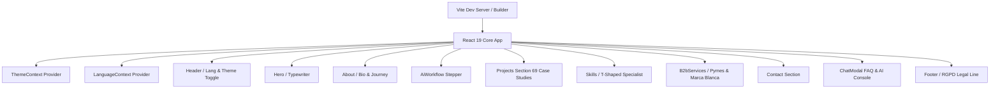
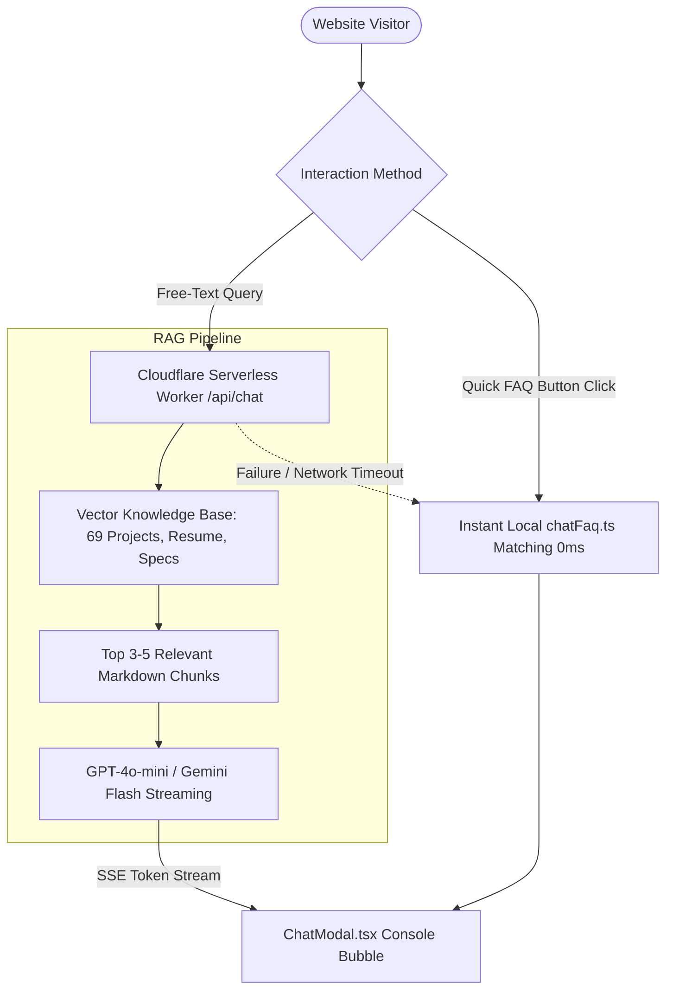

# Portfolio Architecture Specification

A technical overview of the directory structure, build system, deployment mechanisms, and runtime logic of the Artur Yusupov Portfolio Application.

---

## 🏗️ 1. System Architecture

The application is structured as a high-performance **Single Page Application (SPA)** using React 19, TypeScript, and Vite, running on **Node.js 24 LTS**.



---

## 📁 2. Directory Structure

The core files and components are structured as follows:

```text
Portfolio/
├── .agents/
│   └── AGENTS.md           # Workspace Rules & AI Harness Constraints
├── .github/
│   ├── dependabot.yml      # Automated Dependency Governance
│   └── workflows/
│       └── deploy.yml      # CI/CD Automated Security & Deploy Workflow
├── src/
│   ├── assets/             # Global visual resources and images
│   ├── components/         # Modular React Components
│   │   ├── projects/       # 69 Individual project case study files
│   │   ├── About.tsx       # Bio & journey timeline
│   │   ├── AiWorkflow.tsx  # Dynamic Spec-Driven SDLC stepper
│   │   ├── B2bServices.tsx # Dual-tab B2B services (Pymes & White-Label)
│   │   ├── Header.tsx      # Sticky navigation, theme & 3-lang dropdown
│   │   ├── Skills.tsx      # T-Shaped Specialist component
│   │   ├── ChatModal.tsx   # Floating client-side FAQ bot & console
│   │   └── Footer.tsx      # Legal RGPD notice & footer links
│   ├── contexts/           # Theme (Dark/Light) & Language (i18n) providers
│   │   ├── ThemeContext.tsx
│   │   └── LanguageContext.tsx
│   ├── data/
│   │   └── chatFaq.ts      # Multilingual FAQ Chatbot database (EN/UA/ES)
│   ├── locales/            # i18n Translation dictionaries & types
│   │   ├── types.ts        # Strict Translation interface
│   │   ├── en.ts           # English translations
│   │   ├── ua.ts           # Ukrainian translations
│   │   └── es.ts           # Spanish translations
│   ├── App.tsx             # Root Layout manager
│   ├── index.css           # Tailwind v4 import & custom styles
│   └── main.tsx            # Application entrypoint mount
├── DESIGN_SYSTEM.md        # Styles, typography, and grids spec
├── SECURITY.md             # CSP, Base64 encryption, and secrets policy
├── ARCHITECTURE.md         # Current file (System overview)
└── package.json            # Dependencies and scripts definitions
```

---

## ⚡ 3. Runtime Logic & Navigation

### Theme Context
- A React Context (`ThemeContext`) controls dark-mode state by toggling the `.dark` class on the root `document.documentElement` element.
- Tailwind CSS v4 custom variant rules map the `.dark` selector to apply dark-themed styles (`dark:bg-*`, `dark:text-*`).

### Internationalization (i18n) Subsystem
- Driven by a custom `LanguageContext` providing strict type-checked translations via `useLanguage()`.
- **Supported Languages:** 3 languages — English (`en`), Ukrainian (`ua`), and Spanish (`es`).
- **Header Language Switcher:** A 3-language interactive dropdown menu (`🇬🇧 EN`, `🇺🇦 UA`, `🇪🇸 ES`) with custom SVG flag icons and click-outside dismissal.
- **Auto-Detection:** Detects visitor's browser language on first load (`navigator.language` matching `uk`/`ua` → `ua`, `es` → `es`).
- **Persistence:** Persists language preference in `localStorage.portfolio_lang`.
- **Localization:** Supports `en.ts`, `ua.ts`, and `es.ts` translation dictionaries. Project case studies include `descriptionUa`/`descriptionEs` and `fullDescriptionUa`/`fullDescriptionEs` for dynamic localized rendering.

### Smooth Scroll Navigation
- Navigation uses standard HTML `#anchor` links mapped to section `id`s.
- Active states are tracked via scroll event listeners on window offsets, automatically highlighting the corresponding header menu item.

### Client-Side Multilingual FAQ Chatbot
- Driven by a keyword-matching algorithm inside `src/data/chatFaq.ts`.
- Supports trilingual FAQ matching (`question`, `questionUa`, `questionEs` & `answer`, `answerUa`, `answerEs`), returning localized answers via `getBotAnswer(question, lang)`.

---

### View Transitions Navigation Architecture
- **Native W3C Standard:** State transitions between the project grid and `ProjectDetail.tsx` are wrapped in `document.startViewTransition()` with strict TypeScript bindings and graceful non-blocking fallback.
- **Hardware GPU Morphing:** `viewTransitionName: 'project-thumb-${project.id}'` seamlessly morphs thumbnails into full case study banners at 120 FPS with 0 KB external library overhead.
- **Project Card Architecture:** Displays curated top 4 technologies with an interactive `+N` / `- less` toggle per card, fixed 3-line description clamping (`line-clamp-3`), and sticky bottom CTA alignment.

### Progressive Web App (PWA) & Offline Subsystem
- **Web App Manifest (`public/manifest.webmanifest`):** Declares standalone display mode, orientation, brand colors (`#0f172a` / `#7c3aed`), and 192x192/512x512/maskable app icons for native mobile (iOS/Android) and desktop home-screen installation.
- **Service Worker (`public/sw.js`):** Implements a **Stale-While-Revalidate** caching strategy with CacheStorage API, enabling instant sub-second page loads and offline case study navigation with automated background cache invalidation.

### Spec-Driven AI Harness Engineering (SDD)
- **Harness Constraints:** The development lifecycle integrates AI coding agents (Claude Code, Cursor, Antigravity) strictly bound to root specification contracts (`DESIGN_SYSTEM.md`, `SECURITY.md`, `ARCHITECTURE.md`, `AGENTS.md`).
- **Deterministic Verification:** Every automated step enforces SAST (TypeScript strict compilation, ESLint 10), SCA (production dependency audits), and sub-second bundle budget guardrails.

---

## 🚀 4. Build, CI/CD, & Deploy Pipeline

- **Local Compilation:** Vite uses the Rolldown bundler to perform code splitting, generating small modular files for vendor packages, icons, and components. Main bundle is optimized under 200 KB (`198.09 kB`, 53.62 kB gzip).
- **Continuous Integration (GitHub Actions):** On every push to the `master` branch:
  1. Spins up an Ubuntu Linux container on Node.js 24 LTS.
  2. Installs clean deterministic dependencies (`npm ci`).
  3. Executes SAST: Type checks (`npx tsc --noEmit`) and lints (`npm run lint`).
  4. Executes SCA: Production vulnerability audit (`npm audit --only=prod --audit-level=high`).
  5. Compiles production bundle (`npm run build`).
  6. Automatically authenticates with `${{ secrets.GITHUB_TOKEN }}` and deploys the `dist` folder to the `gh-pages` branch, making changes live instantly.

---

## 🔮 5. Future Roadmap: Hybrid RAG AI Chatbot Architecture

A planned upgrade to transition the current client-side keyword matching FAQ chatbot into an enterprise **Hybrid RAG (Retrieval-Augmented Generation)** assistant while preserving 100% of the existing UI/UX:



### Key Milestones:
1. **Knowledge Extraction & Vectorization:** Chunking 69 project case studies, resume data, and spec contracts into semantic vector embeddings.
2. **Serverless Edge Microservice:** Cloudflare Worker endpoint handling semantic search and streaming LLM responses.
3. **Frontend Progressive Adapter:** `src/services/chatService.ts` providing feature-flagged hybrid routing with seamless fallback to static FAQ.
4. **Security Enforcement:** Full compliance with the 6-tier security roadmap defined in [**`SECURITY.md` (Section 5)**](file:///d:/PORTFOLIO/Portfolio/SECURITY.md#5-future-rag-architecture-security-roadmap-ai-chatbot-upgrade).

