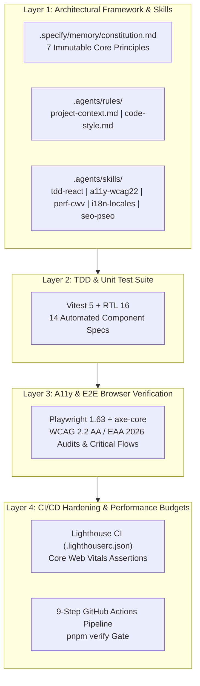

# Artur Yusupov - Professional Portfolio Website

[](https://github.com/YusupovWebArt/Portfolio/actions/workflows/deploy.yml)
[](https://vitest.dev/)
[](https://www.w3.org/TR/WCAG22/)
[](https://github.com/GoogleChrome/lighthouse-ci)
[](https://www.typescriptlang.org/)
[](https://github.com/YusupovWebArt/Portfolio)
[](https://opensource.org/licenses/MIT)

A high-performance, enterprise-grade Single Page Application (SPA) and Progressive Web App (PWA) built with **React 19**, **TypeScript 6.x**, and **Tailwind CSS v4**, engineered using the **2026 AI-Harness methodology (SDD + SDLC + TDD)**. Fully internationalized across 3 languages (**English**, **Ukrainian**, and **Spanish**), audited for European Accessibility Act (**EAA 2026 / WCAG 2.2 Level AA**) compliance, optimized for sub-second Core Web Vitals, and hardened with a **9-step CI/CD DevSecOps** deployment pipeline.

🔗 **Live Website:** [https://yusupovwebart.github.io/Portfolio/](https://yusupovwebart.github.io/Portfolio/)

---

## 🛠️ Technology Stack

- **Core Framework:** React 19 (SPA Architecture with modern hooks)
- **Runtime Environment:** Node.js 24 LTS
- **Programming Language:** TypeScript 6.x (Strict Type Safety, Zero-`any` Policy)
- **Styling & Design System:** Tailwind CSS v4 (CSS variables, native dark/light variants, glassmorphism)
- **Build Tool & Bundler:** Vite 8.x (Rolldown engine for optimized code-splitting and sub-second HMR)
- **Progressive Web App:** Web App Manifest & Service Worker with Stale-While-Revalidate caching
- **Native Animation:** W3C View Transitions API for 120 FPS hardware-accelerated card morphing
- **Unit & Component Testing (TDD):** Vitest 5.x & React Testing Library 16.x (JSDOM environment)
- **Browser E2E & Accessibility:** Playwright 1.63.x & `@axe-core/playwright` (WCAG 2.2 Level AA audits)
- **Performance Budget Engine:** Lighthouse CI (`@lhci/cli`) with automated CWV threshold assertions
- **Package Manager:** pnpm 11.x (Fast, disk space-efficient with global NTFS content-addressable store)
- **Internationalization (i18n):** Custom type-safe 3-language engine (`en`, `ua`, `es`) with browser auto-detection
- **Icons:** React Icons & Lucide Icons (with `aria-hidden` wrappers and compliant SVG contrast)
- **DevSecOps & CI/CD:** GitHub Actions 9-step automated quality and deployment pipeline

---

## ⚡ Core Technical Pillars



### 🤖 1. 2026 AI-Harness Architecture (SDD + SDLC + TDD)
- **Immutable Constitution:** Governed by [`.specify/memory/constitution.md`](.specify/memory/constitution.md) enforcing strict zero-`any` typing, DevSecOps obfuscation, trilingual parity, and WCAG 2.2 AA accessibility.
- **Antigravity Custom Agent Skills:** 5 domain-specific skills inside [`.agents/skills/`](.agents/skills/):
  - `tdd-react`: Red-Green-Refactor test cycle and semantic RTL queries.
  - `a11y-wcag22`: European Accessibility Act (EAA 2026 / EN 301 549) and WCAG 2.2 Level AA guidelines.
  - `perf-cwv`: Core Web Vitals budgets (LCP <= 1.2s, CLS 0.00, FCP <= 0.8s), WebP media pipeline.
  - `i18n-locales`: 3-language synchronization and dictionary key parity enforcement.
  - `seo-pseo`: Schema.org structured data, JSON-LD microdata, and Open Graph standards.
- **Spec-Driven Lifecycle:** Feature requirements are authored under `specs/<feature-slug>/` before implementation, eliminating hallucinations and context drift.

### 🧪 2. Automated TDD & Unit Testing Layer (Vitest)
- **Framework:** Vitest 5 with isolated JSDOM testing environments.
- **Test Suite:** 14 automated unit/component specifications covering:
  - Theme toggling, document root class mutation, and localStorage state persistence.
  - Trilingual dictionary synchronization, key parity, and browser locale auto-detection.
  - Project showcase category filtering and modal selection triggers.

### ♿ 3. European Accessibility Act (EAA 2026) & WCAG 2.2 Level AA
- **Automated Scanning:** Integrated Playwright with `@axe-core/playwright` to test the full DOM tree across all viewports and color themes.
- **Accessibility Benchmarks:**
  - 0 critical or serious violations under `wcag2a`, `wcag2aa`, `wcag21a`, `wcag21aa`, and `wcag22aa`.
  - Contrast ratio of >= 4.5:1 for normal text and >= 3:1 for large text across dark and light themes.
  - Target Size Minimum (SC 2.5.8): All interactive buttons and stepper controls meet >= 24x24px.
  - Decorative SVGs isolated with `aria-hidden="true"` to prevent screen reader clutter.

### 🚀 4. Core Web Vitals & Lighthouse CI Integration
- **Configured Thresholds:** [`.lighthouserc.json`](.lighthouserc.json) asserts quality on every build:
  - Accessibility: `>= 0.95`
  - SEO: `>= 0.95`
  - Best Practices: `>= 0.90`
  - Performance: `>= 0.85`
- **PWA & Offline Pipeline:** Custom Service Worker (`public/sw.js`) with **Stale-While-Revalidate** caching for instant subsequent loads and offline availability.
- **Native View Transitions API:** W3C View Transitions API standard for smooth GPU-accelerated card expansion without heavy external animation libraries.

### 🌐 5. Trilingual Internationalization Engine (i18n)
- **Supported Languages:** English (`en`), Ukrainian (`ua`), and Spanish (`es`).
- **Smart Locale Handling:** Custom React `LanguageContext` detecting browser preferences with persistent `localStorage` storage and dynamic `<html lang="...">` DOM attribute updates.
- **69 Localized Case Studies:** Complete parity across all 69 project case studies with technical architecture diagrams.

### 🛡️ 6. DevSecOps & Security Hardening
- **Zero Secrets Policy:** Zero API keys, tokens, or credentials stored in source control.
- **Anti-Scraping Obfuscation:** Personal contact channels (email, phone, Telegram, WhatsApp) are stored in Base64 format and decrypted on client interaction.
- **Security Headers:** Strict Content Security Policy (CSP), Permissions-Policy (`camera=(), microphone=(), geolocation=()`), and Referrer-Policy (`strict-origin-when-cross-origin`).
- **SCA Clean:** Zero known vulnerabilities via `pnpm audit --prod --audit-level=high`.

---

## 📁 Repository Structure

```text
Portfolio/
├── .agents/
│   ├── rules/
│   │   ├── code-style.md         # Coding style constraints and rules
│   │   └── project-context.md    # Active architectural context and tools
│   ├── skills/                   # Antigravity specialized agent skills
│   │   ├── a11y-wcag22/          # WCAG 2.2 AA & EAA 2026 procedures
│   │   ├── i18n-locales/         # Trilingual synchronization rules
│   │   ├── perf-cwv/             # Core Web Vitals budgets and pipeline
│   │   ├── seo-pseo/             # Schema.org JSON-LD structured data
│   │   └── tdd-react/            # TDD Red-Green-Refactor test standards
│   └── AGENTS.md                 # Root AI harness guidelines & rules
├── .github/
│   ├── dependabot.yml            # Automated weekly dependency governance
│   └── workflows/
│       └── deploy.yml            # 9-step CI/CD automated deploy pipeline
├── .specify/
│   └── memory/
│       └── constitution.md       # 7 Non-negotiable immutable project principles
├── e2e/
│   ├── accessibility.spec.ts     # Playwright + axe-core WCAG 2.2 AA audit suite
│   └── critical-flows.spec.ts    # Playwright browser E2E flows (i18n, themes, nav)
├── specs/                        # Spec-Driven Development (SDD) feature specs
├── src/
│   ├── components/               # React UI components (Hero, About, Skills, etc.)
│   │   └── projects/             # 69 Detailed Project Case Studies
│   ├── contexts/                 # ThemeContext & LanguageContext providers
│   ├── data/                     # Localized AI chatbot FAQ knowledge base
│   ├── locales/                  # Trilingual dictionaries (en.ts, ua.ts, es.ts)
│   ├── test/                     # Vitest test setup and matchers
│   ├── App.tsx                   # Main layout component
│   └── main.tsx                  # Application entrypoint
├── .lighthouserc.json            # Lighthouse CI performance & quality assertions
├── playwright.config.ts          # Playwright test configuration
├── vitest.config.ts              # Vitest test configuration
├── ARCHITECTURE.md               # Architecture and system documentation
├── DESIGN_SYSTEM.md              # UI/UX design tokens and constraints
├── SECURITY.md                   # DevSecOps policy and security specs
└── package.json                  # Dependencies, scripts, and build tasks
```

---

## 💻 Local Development & Quality Gates

```bash
# 1. Clone the repository
git clone https://github.com/YusupovWebArt/Portfolio.git

# 2. Install dependencies
pnpm install

# 3. Start local development server
pnpm dev

# 4. Run automated TDD unit & component specs
pnpm test

# 5. Run Playwright E2E & WCAG 2.2 AA accessibility audits
pnpm test:e2e

# 6. Run Lighthouse CI performance audit
pnpm audit:lhci

# 7. Run unified complete quality gate (SAST + TDD + E2E + SCA + Build)
pnpm verify

# 8. Build production bundle
pnpm build
```

---

## 🚦 GitHub Actions CI/CD Pipeline

Every push to `master` triggers an automated 9-step pipeline:

1. **SAST Type Verification:** `pnpm exec tsc --noEmit`
2. **SAST ESLint Guardrails:** `pnpm lint`
3. **TDD Automated Tests:** `pnpm test` (Vitest unit suite)
4. **SCA Vulnerability Audit:** `pnpm audit --prod --audit-level=high`
5. **Build Production Bundle:** `pnpm build`
6. **Install Playwright Chromium:** `pnpm exec playwright install --with-deps chromium`
7. **A11y & E2E Audits:** `pnpm test:e2e` (Playwright & axe-core)
8. **Lighthouse CI Audit:** `pnpm audit:lhci` (CWV budgets)
9. **Deploy to GitHub Pages:** Automated deploy of verified `dist/` to `gh-pages`

---

## 📄 License

This project is licensed under the MIT License - see the [LICENSE](LICENSE) file for details.
