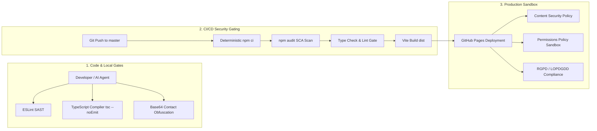

# Portfolio Security Policy & DevSecOps Specification

This document details the security architecture, DevSecOps pipelines, automated compliance gates, secret management policies, and runtime protections implemented across the Artur Yusupov Portfolio Application.

---

## 🏗️ DevSecOps Pipeline Architecture

Security is integrated across the entire Software Development Life Cycle (SDLC), from local development and agentic AI coding to automated CI/CD gating and production client execution.

---

## 🔒 1. Zero-Commit Credentials & Secret Management

- **No Secrets in Code:** Under no circumstances should API keys, private domains, database passwords, or personal credentials be written directly into source files.
- **Environment Variables:** All environment-specific variables must reside in a `.env` file (strictly excluded via `.gitignore`) and accessed exclusively via `import.meta.env.*`.
- **Git History Auditing:** If a credential is ever committed, it must be purged by rewriting git history (e.g., via `git filter-repo`), as simple deletion commits retain the secret in past commit trees.

---

## 🔍 2. Static Application Security Testing (SAST) & Type Safety

- **Strict Type Checking (Zero `any` Policy):** All components, props, state, and utility functions must be strictly typed. Proposal of new code additions requires passing `npx tsc --noEmit` with zero errors.
- **Linting & React Hooks Guardrails:** `eslint` validates adherence to modern ECMAScript standards and enforces React Hook rules (`eslint-plugin-react-hooks`).
- **AI Agent Workspace Harness:** The project rules defined in `.agents/AGENTS.md` force all AI coding assistants (Antigravity, Claude Code, Cursor) to run static analysis and linting before proposing or merging modifications.

---

## 📦 3. Software Composition Analysis (SCA) & Dependency Governance

- **Continuous Vulnerability Scanning:** Every package installation and CI run audits the dependency tree via `npm audit --only=prod --audit-level=high` (Targeting 0 production vulnerabilities).
- **Automated Dependabot Lifecycle:** Configured in [`.github/dependabot.yml`](file:///.github/dependabot.yml) to scan weekly:
  - **Grouped Updates:** Minor and patch updates are grouped into unified PRs to prevent dependency drift.
  - **Breaking Change Pinning:** Core compilers and layout dependencies with breaking migrations (e.g., `typescript >= 7.0.0`, `lucide-react >= 1.0.0`) are pinned to preserve build stability.

---

## 🛡️ 4. Client-Side App Hardening & HTTP Security Headers

The application enforces a sandboxed browser environment directly via `<meta>` tags in [`index.html`](file:///index.html):

1. **Content Security Policy (CSP):**
   - Restricts script and stylesheet execution to `'self'` and explicitly allowlisted vendors (Google Tag Manager, Google Analytics, Google Fonts).
   - Blocks unauthorized `iframe` and `object` embeds (`frame-src 'none'; object-src 'none'`).
2. **Referrer Policy:**
   - Set to `strict-origin-when-cross-origin` to ensure that full URL paths and query parameters are stripped during external transitions.
3. **Permissions Policy:**
   - Explicitly revokes browser access to sensitive hardware APIs: `camera=(), microphone=(), geolocation=()`.

---

## 🕵️ 5. Anti-Scraping & Personal Data Obfuscation

To protect email addresses, phone numbers, and messaging handles from automated scraping bots and spam crawlers:

- **Encoding:** Contact URLs and identifiers are stored as Base64-encoded strings (e.g., `YWJjQGV4YW1wbGUuY29t`).
- **Dynamic Runtime Decryption:** React components decode contact details dynamically at runtime:
  - Decoding triggers strictly upon user interaction (mouse hover or click).
  - Obfuscated values are injected into the DOM tree only at the moment of interaction, preventing static web crawlers from extracting raw text from the initial HTML payload.
- **Crawler Fallback:** A `<noscript>` wrapper inside `#seo-fallback` presents indexable text descriptions for SEO crawlers while strictly avoiding raw, scrapable `mailto:` or `tel:` links.

---

## 🚀 6. CI/CD Automated Security Gating (GitHub Actions)

Configured in [`.github/workflows/deploy.yml`](file:///.github/workflows/deploy.yml), every push to the `master` branch triggers an automated 4-stage security gate before deployment:

1. **Deterministic Dependency Installation:** `npm ci` verifies that `node_modules` precisely matches `package-lock.json`.
2. **SCA Vulnerability Gate:** `npm audit --only=prod --audit-level=high` fails the pipeline if any high/critical vulnerability is detected.
3. **SAST Compilation Gate:** `npx tsc --noEmit` verifies strict TypeScript compilation.
4. **Code Quality Gate:** `npm run lint` ensures full ESLint compliance.
5. **Deployment:** Only if all 4 gates pass, the compiled `dist/` bundle is deployed to GitHub Pages.

---

## 🤖 7. Future RAG Architecture Security Roadmap (AI Chatbot Upgrade)

When upgrading the client-side FAQ chatbot to a serverless **Hybrid RAG (Retrieval-Augmented Generation)** architecture, the following 6 defense tiers must be strictly implemented:

### 🛡️ Tier 1: Zero-Commit API Key Protection (Zero-Commit Policy)
- **Risk:** Embedding OpenAI/Gemini/Anthropic keys directly in the client bundle exposes them to extraction via browser DevTools.
- **Enforcement:** API keys must never be committed to Git or exposed to the client. Keys are stored exclusively in encrypted environment secrets on the serverless edge (e.g., Cloudflare Workers via `wrangler secret put OPENAI_API_KEY`). The browser communicates only with the serverless proxy.

### 🛡️ Tier 2: Domain Whitelisting (CORS Protection)
- **Risk:** Unauthorized third-party sites copying the endpoint URL to consume API quotas.
- **Enforcement:** The serverless worker strictly validates the `Origin` header. Requests are accepted exclusively from `https://yusupovwebart.github.io` (and `localhost` for development). All other origins receive an immediate `403 Forbidden`.

### 🛡️ Tier 3: Abuse Prevention & Hard Budget Caps (Rate Limiting & Cost Control)
- **Risk:** Malicious bots spamming thousands of requests per minute to drain API credits.
- **Enforcement:**
  - **IP-Based Rate Limiting:** Enforce a strict threshold of maximum 5–10 requests per minute per IP.
  - **Hard Spend Limits:** Configure a monthly hard ceiling (e.g., $2.00/month) in the LLM provider console. If reached, the system auto-shuts off dynamic calls and falls back to static FAQ.
  - **Payload Clamping:** Sanitize and truncate user input to 300 characters max, capping model completions to 250 tokens.

### 🛡️ Tier 4: Prompt Injection Guardrails & Grounding (AI Safety)
- **Risk:** Malicious prompts attempting to hijack persona, negotiate unauthorized rates, or leak system prompts.
- **Enforcement:**
  - Rigid system prompt instructing the model to act strictly as Artur's AI Assistant, ground answers exclusively on verified portfolio facts, and never agree to custom pricing or reveal internal prompts.
  - Input Sanitization: Strip all HTML, script, and markdown executable injections before passing queries to the vector search and LLM context.

### 🛡️ Tier 5: EU RGPD / LOPDGDD Privacy Compliance
- **Risk:** Illegally storing visitor IP addresses or sensitive chat logs under EU privacy laws.
- **Enforcement:**
  - **Zero-Log Architecture:** The serverless proxy processes requests ephemerally in-memory without persisting user chat logs or IP addresses to any persistent database.
  - Contact data remains Base64-obfuscated across all dynamic retrieval pipelines.

### 🛡️ Tier 6: Resilient Fallback (Graceful Degradation)
- **Enforcement:** If network latency spikes, rate limits are hit, or the serverless backend is unreachable, the client frontend (`ChatModal.tsx`) automatically and silently falls back to the local static [`chatFaq.ts`](file:///d:/PORTFOLIO/Portfolio/src/data/chatFaq.ts) matching engine with zero UI disruption.

---

## ⚖️ 8. European Regulatory & Privacy Compliance (RGPD / LOPDGDD)

- **Cookie-Free Architecture:** The site operates without intrusive tracking cookies or unauthorized fingerprinting scripts.
- **Anonymized Analytics:** Google Analytics (GA4) is configured with IP anonymization and respects user privacy preferences.
- **EU Invoicing & Legal Footprint:** The footer explicitly declares business and tax invoicing compatibility for professionals and companies in Spain and the European Union.

